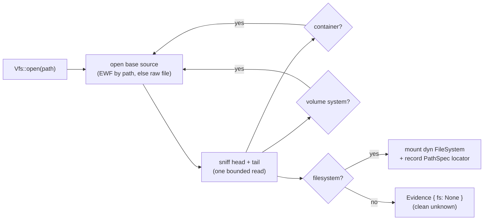

# forensic-vfs-engine

[](https://crates.io/crates/forensic-vfs-engine)
[](https://docs.rs/forensic-vfs-engine)
[](https://www.rust-lang.org)
[](LICENSE)
[](https://github.com/sponsors/h4x0r)

[](https://github.com/SecurityRonin/forensic-vfs-engine/actions/workflows/ci.yml)
[](https://github.com/SecurityRonin/forensic-vfs-engine/actions/workflows/ci.yml)
[](https://github.com/rust-secure-code/safety-dance/)
[](deny.toml)

**One `Vfs::open(path)` — point it at any disk image and get a mounted, read-only filesystem back.**

`forensic-vfs-engine` is the registry + resolver over the [`forensic-vfs`](https://crates.io/crates/forensic-vfs)
contracts: it sniffs the container → volume-system → filesystem stack of a piece
of evidence and mounts the first filesystem it recognizes as a `dyn FileSystem`.
It is the ORCHESTRATION crate that wires every SecurityRonin fleet reader into a
single detect-and-mount call, so you never hand-code an image-format ladder again.

## Above the fold

```rust
use forensic_vfs_engine::{walk, Vfs};
use std::path::Path;

// Detect the stack (EWF → MBR → NTFS, DMG → HFS+, raw ext4, …) and mount it.
let evidence = Vfs::new().open(Path::new("disk.E01"))?;

let Some(fs) = evidence.fs else {
    // A source nothing recognizes — a clean unknown, never a silent error.
    return Ok(());
};

// The locator records the exact open-recipe: e.g. "…/container:ewf/vol:mbr/fs:ntfs".
println!("{}", evidence.root.to_uri());

for entry in walk(fs.as_ref())? {
    if let Some(name) = entry.path.last() {
        println!("{}", String::from_utf8_lossy(name));
    }
}
# Ok::<(), forensic_vfs::VfsError>(())
```

```toml
[dependencies]
forensic-vfs-engine = "0.1"
```

## Batteries-included — every fleet reader compiled in

The zero-config build registers the whole fleet; no `--features` dance on an
evidence workstation.

| Layer | Readers |
|---|---|
| **Container** | EWF/E01 ✅ · VHD ✅ · VHDX ✅ · VMDK ✅ · QCOW2 ✅ · DMG ✅ · AFF4 ✅ |
| **Volume system** | MBR ✅ · GPT ✅ · APM ✅ |
| **Filesystem** | NTFS ✅ · ext2/3/4 ✅ · XFS ✅ · ISO 9660 ✅ · APFS ✅ · HFS+/HFSX ✅ · exFAT ✅ · FAT12/16/32 ✅ |

Nesting resolves automatically — `EWF → GPT → NTFS`, `DMG → APM → HFS+`,
`AFF4(Zip) → ext4` — up to a bounded recursion depth (a decompression-bomb guard).

## Snapshots — the `[H]` state-history seam

```rust
# use forensic_vfs_engine::Vfs;
# use std::path::Path;
let cohort = Vfs::new().snapshots(Path::new("mac.dmg"))?; // Vec<SnapshotView>, time-ordered
for view in &cohort {
    let mounted = Vfs::new().open_snapshot(Path::new("mac.dmg"), view.xid())?;
    let _ = mounted;
}
# Ok::<(), forensic_vfs::VfsError>(())
```

Evidence with no APFS filesystem yields an **empty** cohort — a genuinely clean
"no snapshots here", not an error.

## Trust but verify

- **Input-fuzzed** — `fuzz_resolve` drives `Vfs::open_source` over arbitrary
  bytes; the invariant is *resolving attacker-controllable disk bytes must never
  panic*. Each underlying reader carries its own per-structure fuzz targets.
- **Panic-free by lint** — `unsafe_code = forbid`, `clippy::unwrap_used` /
  `expect_used = deny` across production code, over bounds-checked readers.
- **Validated against real artifacts** — every end-to-end test resolves a real,
  oracle-validated fixture (TSK / `hdiutil` / `qemu-img` / `pyewf`) and confirms
  the known ground-truth file surfaces. See [`docs/validation.md`](docs/validation.md).

## How it resolves



---

[Privacy Policy](https://securityronin.github.io/forensic-vfs-engine/privacy/) · [Terms of Service](https://securityronin.github.io/forensic-vfs-engine/terms/) · © 2026 Security Ronin Ltd
